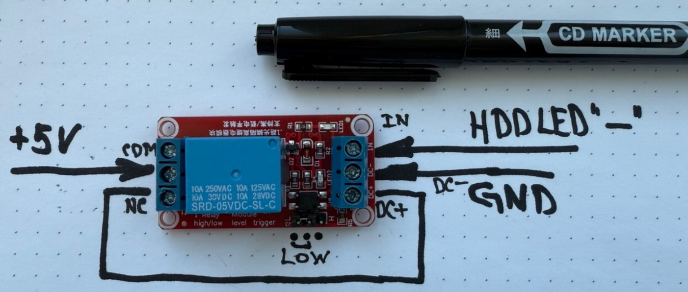

# Petsalka - The $2 Mechanical HDD Clicker

*It all started with an argument — the kind that usually goes nowhere online. But not this time.*

 
<!-- Сюда потом вставите ссылку на фото -->

In a Telegram chat for retro-computer enthusiasts, someone showed off an "HDD clicker": a neat black PCB, a microcontroller, a handful of parts, trim pots, a buzzer… and a price tag around €25.

I couldn't resist and blurted out:

> "Can't this be done simpler — with just a couple transistors and capacitors? Do you really have to slap a microcontroller in there?"

The reply was polite, but definitely a challenge:

> "The design was made by the respected Serdaco… Their authority matters to me. Of course, you can make your own design and sell it much cheaper. If your two-transistor gadget is a good imitation — I guarantee I'll buy several."

*Alright then. Challenge accepted.*

## 🤔 What I wanted to build

The idea was obvious: take the signal from the drive activity LED (HDD LED) and turn it into sound. At first I was thinking the classic route: a transistor switch + a buzzer, maybe some RC circuit so the "clicks" would sound right.

I started digging through common circuits and sketching how to assemble it — and along the way I stumbled upon something that flipped the whole plan: switching **with a relay**.

A relay!!! That was the moment: here it is — a truly natural **mechanical** sound source. Not a speaker, not a piezo, but a real "click", almost like the heads in old HDDs. That’s the gem of the idea: **the sound isn't synthesized, it's physical.**

## 💡 A Lucky Find

Then things got fun. I started thinking where to get a tiny relay. I opened a marketplace and almost immediately found a dirt-cheap Arduino board: "single-channel relay module with opto-isolation". I looked closer — and everything was already there: an optocoupler, a transistor driver, a flyback diode across the coil, and the relay itself. That's basically a ready-made clicker!

And as a bonus (while I was browsing schematics) it became clear why these modules are so convenient for this hack:

- **Input opto-isolation** — less chance to load or accidentally damage the motherboard.
- **Coil diode** — kills the inductive kick when the relay turns off.
- You can power the "power side" from your own +5 V, and use HDD LED only as a control signal.

## 🔌 First Power-On: It Works... But Not the Way I Wanted

Wiring it up was straightforward:

1.  Take the signal from the **HDD LED** header on the motherboard.
2.  Feed it into the relay module input **IN**.
3.  Power the module from the PSU's **+5 V**.
4.  Set the correct input logic on the module (LOW/HIGH — depends on the specific board and HDD LED polarity).

During boot I immediately heard the familiar click-click — the hypothesis worked.

But as soon as I gave the disk real work (copying lots of files, extracting archives, etc.), there was a catch: with high activity the signal becomes a **long pulse**, the relay **pulls in and stays there**, and instead of a series of "head clicks" you get one click… and then silence. I needed it to keep clicking even on a long pulse.

## ⚙️ Unexpected Discovery: The Relay Can Interrupt Itself

I made some coffee and didn't even have time for a sip — the solution popped into my head: **What if the relay cuts its own power?**

Then, during continuous activity, it will:
1.  Click as it pulls in.
2.  Break its own power.
3.  Release.
4.  Get power back — and repeat.

In other words, the relay becomes a simple mechanical "oscillator" — no capacitors, no timers, no microcontroller.

### How I wired it (Conceptually)

I kept **IN** as the control signal, and routed power through the relay contacts:
- Instead of feeding +5 V directly into **VCC**, I brought +5 V to the relay's **COM** terminal.
- I fed the module's **VCC** through the **NC** (Normally Closed) contact.

**Resulting cycle:**
1.  Activity starts -> Relay pulls in (**CLICK**).
2.  Relay switches from NC to NO, cutting power to the module's VCC.
3.  Module loses power -> Relay releases.
4.  Power is restored through NC contact.
5.  If HDD activity signal is still present, the cycle repeats -> **CLICK... CLICK... CLICK...**

## ✅ The Result

In the end I got an "HDD clicker":
- For roughly **$2**.
- With **no soldering** and no circuit redesign.
- With input **opto-isolation** (most of these modules already have it).
- With a real, satisfying **mechanical relay sound**.

I named it **"Petsalka"** (Пецалка) — because it goes *pets-pets-pets… pets-pets* exactly when the computer is "thinking with its disk".

And yes: it's hard to call it "my device". It's more like a fun way to repurpose a cheap relay module — and almost anyone can repeat it.

https://github.com/user-attachments/assets/606d7f4b-9480-40fd-b7b4-cf0904625952

---

## 🛑 Disclaimer / How to Repeat Safely

If you recreate this:
- Double-check the **input logic** (LOW/HIGH trigger) and the **HDD LED polarity** on your specific motherboard — it can differ between systems.
- Be careful when connecting to a live PSU. The +5V standby power is always on if the PSU is plugged in.
- You are responsible for your own hardware. This is a hack, proceed at your own risk.

## License 

This project is an open-source hardware and documentation project.

- **The text, images, schematics, and all other documentation in this repository** are licensed under the **MIT License** (see [LICENSE](LICENSE) file). You are free to copy, modify, and distribute them.
- **The hardware idea and design** itself is released into the public domain under the **CERN Open Hardware Licence Version 2 - Weakly Reciprocal (CERN-OHL-W)** or, at your option, any later version. In simple terms: feel free to build, modify, and sell the Petsalka device, but if you publicly release your modifications to the hardware design, do so under the same license to keep it open.
